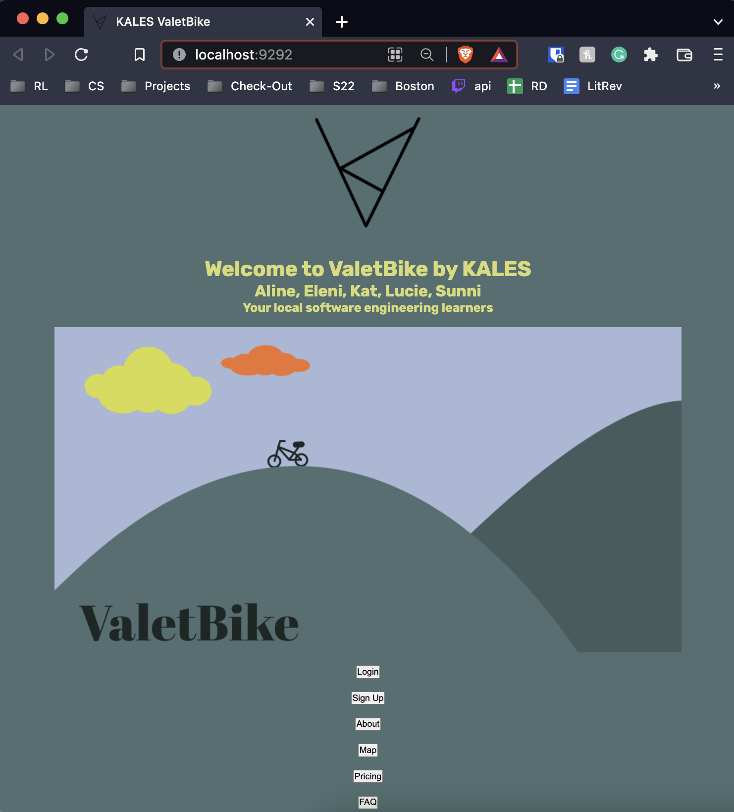

# KALES meets ValetBike

Smith College CSC223: Software Engineering
Starter App for ValetBike project

### Overview of dev environment setup (e.g. updates to _env.rb)

There are no significant changes to the dev environment.

- Rails
- Bootstrap (downloaded but not integrated, hope to use in MVP)
- Yarn (downloaded but not integrated, hope to use in tandem with Bootstrap in MVP)

## General Configuration Steps

### Instructions for populating database (e.g. a rake task or seed setup)
1. `bundle install`
2. `rake db:migrate`
3. `rackup` or `rails s`

* If using `rackup` open http://localhost:9292 (or http://127.0.0.1:9292) in a browser
* If using `rails s` open http://localhost:3000 (or http://127.0.0.1:3000) in a browser

* You should see ValetBike welcome page

### Description of prototype functionality
- Bare bones layout (Front-End and Back-End) 
    - Installed Bootstrap (not implemented yet)
    - Created image folder
    - Set-up controllers
    - Set-up helpers
    - Added and edited models
    - Added layouts
    - Added to routes.rb
    - Set up robots.txt
- Database
    - Added new migrations
    - Set up schema.rb
    - Set up seeds.rb
    - Set up an import_data rake
- Utilize Google Maps and PayPal
    - Opted to using Paypal buttons for our MVP which do not need additional credentials but instead a transfer of code (minimal to non-existent functionality)
    - Google Maps credentials established on Google Cloud, but need to integrate code out of the maps file, and into the html. DEBATING using leaflet.

### Recommended walkthrough steps to observe key features
- Currently, we recommend going through the following files to observe what we have attempted to set-up as we do not have functionality without errors. Our task is to solve this isssue this week, so we can continue implementing our features.

    > - `app/controllers`
    > - `app/map`
    > - `app/models`
    > - `app/views`
    > - `db/`

### Citations
- https://github.com/AnyKeyOrg/anykey
- https://guides.rubyonrails.org/
- https://www.digitalocean.com/community/tutorials/how-to-add-bootstrap-to-a-ruby-on-rails-application
- https://www.digitalocean.com/community/tutorial_series/rails-on-containers
- https://getbootstrap.com/docs/3.4/components/
- https://getbootstrap.com/docs/3.3/getting-started/
- https://stackoverflow.com/questions/42175701/rails-5-google-places-gem-error
- https://jaryl.medium.com/disciplined-rails-models-controllers-the-rails-way-bbc940822136
- https://rubygems.org/gems/leaflet-rails/versions/1.7.0
